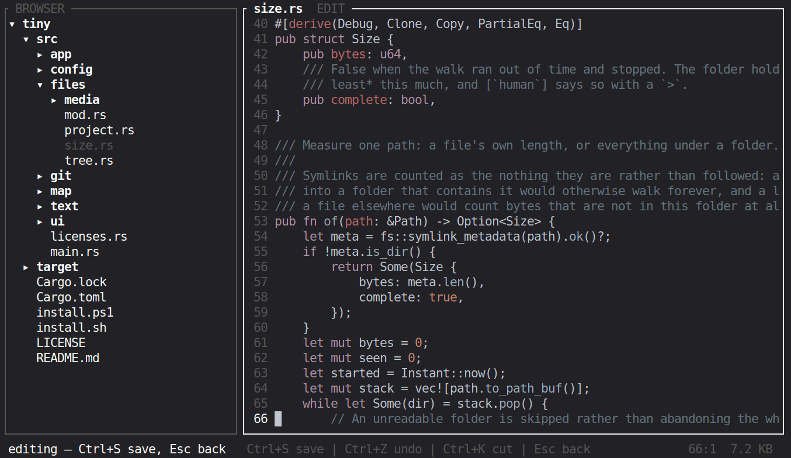
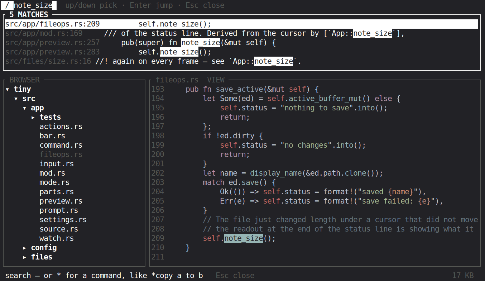
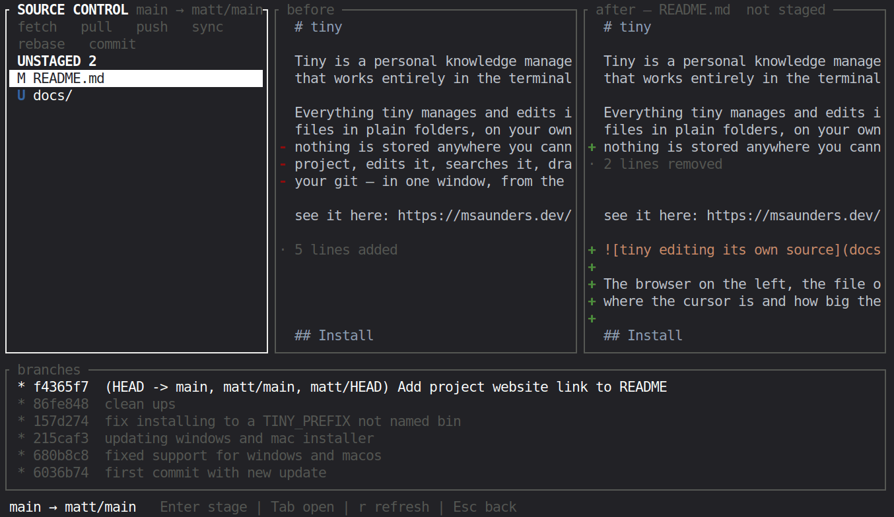
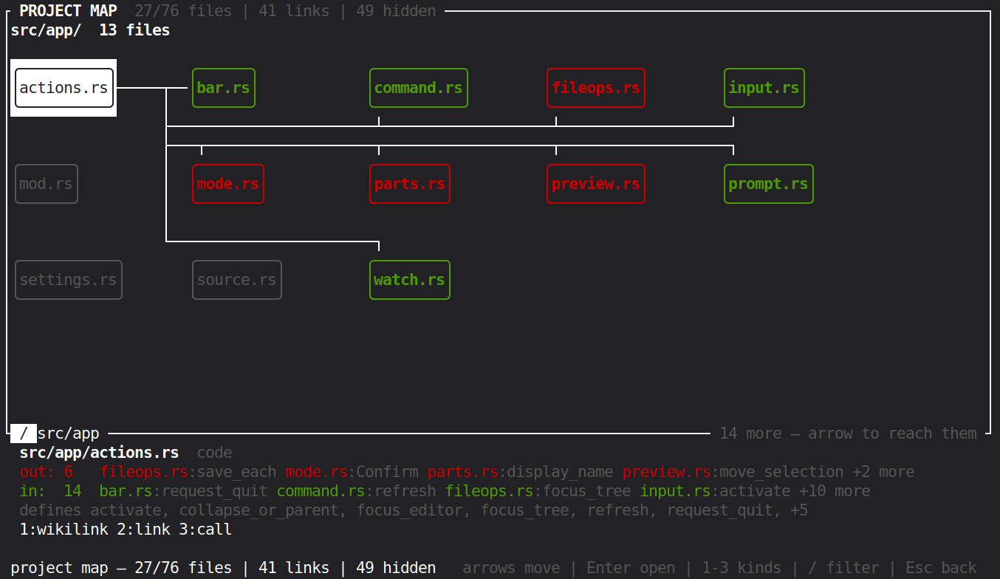
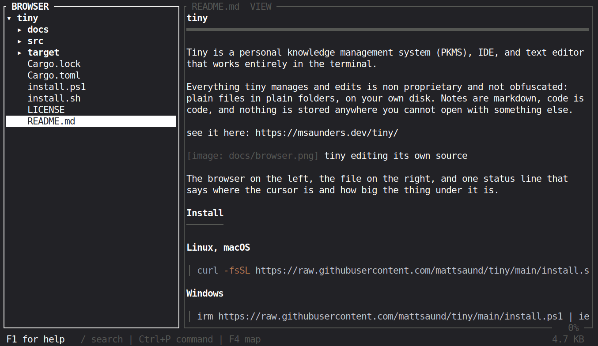

# tiny

Tiny is a personal knowledge management system (PKMS), IDE, and text editor
that works entirely in the terminal.

Everything tiny manages and edits is non proprietary and not obfuscated: plain
files in plain folders, on your own disk. Notes are markdown, code is code, and
nothing is stored anywhere you cannot open with something else.

Try it here: https://msaunders.dev/tiny/



The browser on the left, the file on the right, and one status line that says
where the cursor is and how big the thing under it is.

## Install

**Linux, macOS**

```sh
curl -fsSL https://raw.githubusercontent.com/mattsaund/tiny/main/install.sh | sh
```

**Windows**

```powershell
irm https://raw.githubusercontent.com/mattsaund/tiny/main/install.ps1 | iex
```

**From a checkout**

```sh
git clone https://github.com/mattsaund/tiny.git && cd tiny && sh install.sh
```

The installer takes the ready-made binary when there is one for your machine,
and otherwise builds from source — offering Rust, and your system's compiler,
if they are missing. `tiny --uninstall` removes it again and leaves your notes
alone.

## Use

```sh
tiny                      # this folder, or the project it sits inside
tiny ~/notes              # that folder — created empty if missing
tiny ~/code/main.py       # that one file, in the editor
```

## One bar finds everything



`/` opens it. It searches names and contents as you type, marks every hit in
the file behind it, and `Enter` jumps to the one you picked. Start the line
with `*` and the same field is the command line.

## Git without leaving



What has changed on the left, the file before and after beside it, the branch
graph underneath. `Enter` stages a file — or a whole section from its header —
and the `commit` button opens a message box across both columns. It runs the
`git` already on your machine, so your aliases and credentials work.

## A map of the project



Every file, grouped by folder, with lines to whatever the file under the cursor
is joined to: green for the files that reach it, red for the ones it reaches.
The links are wikilinks, markdown links, and one file calling a function
another defines.

## Notes are markdown



Headings, lists, tables and code render as you read them. `Enter` drops into
the raw text to edit, `Ctrl+S` saves.

## Keys

`F1` lists every key, read from your own keymap.

| key | does |
|---|---|
| arrows — or `i` `j` `k` `l` | move |
| `Enter` | open or close a folder, or edit a file |
| `Tab` | hand the keyboard to the file |
| `Esc` | back — and from the browser, quit |
| `Ctrl+S` | save — on a folder, everything unsaved in it |
| `/` | the bar: search, or `*` for a command |
| `Ctrl+1` `Ctrl+2` `Ctrl+3` | browser · git · map |

Commands go in the same bar, after a `*`:

```
*new [file.txt]        *rename [old] to [new]     *delete [path]
*mkdir [folder]        *copy [file] to [folder]   *replace [old] [new]
*line [42]             *set [setting] to [value]  *config
```

## Config

`*config` opens the settings area and `*set` changes one from anywhere; both
write `tiny.conf` — `~/.config/tiny/tiny.conf`, or `%APPDATA%\tiny\tiny.conf`
on Windows. Keys live in a `[keys]` section by action name:

```toml
[keys]
down        = "z"          # one key
up          = "up i w"     # or several, space separated
editor.undo = "ctrl+u"
```

A name with no prefix is one key doing one job wherever it applies — `down` is
down in the browser, in a note, on the map and in the change list. A prefix
means the key belongs to that pane alone.

## Contributing

**AI policy.** I am open to AI and agentic coding, but the code written needs
to follow specific guidelines:

1. MUST be human readable, acceptable variable/function names.
2. Easily traceable, following a good program flow.
3. Contributors MUST look at and document code and code changes. You need to
   understand the code that is being written.

**Tests.** `cargo test` renders real frames through ratatui's test backend, so
navigation, editing, search, git and the settings area are covered without a
terminal. `cargo clippy` should be quiet and `cargo fmt` clean before a pull
request; CI checks all three, on Linux, macOS and Windows.

## License and credits

Created by Matthew Saunders — https://msaunders.dev

MIT. See [LICENSE](LICENSE). `tiny --licenses` prints the whole picture: tiny's
own terms, every crate compiled into the binary — all permissive, none
copyleft — and the syntax definitions, which come from the
[bat](https://github.com/sharkdp/bat) project by way of
[two-face](https://codeberg.org/CosmicHarper/two-face).
